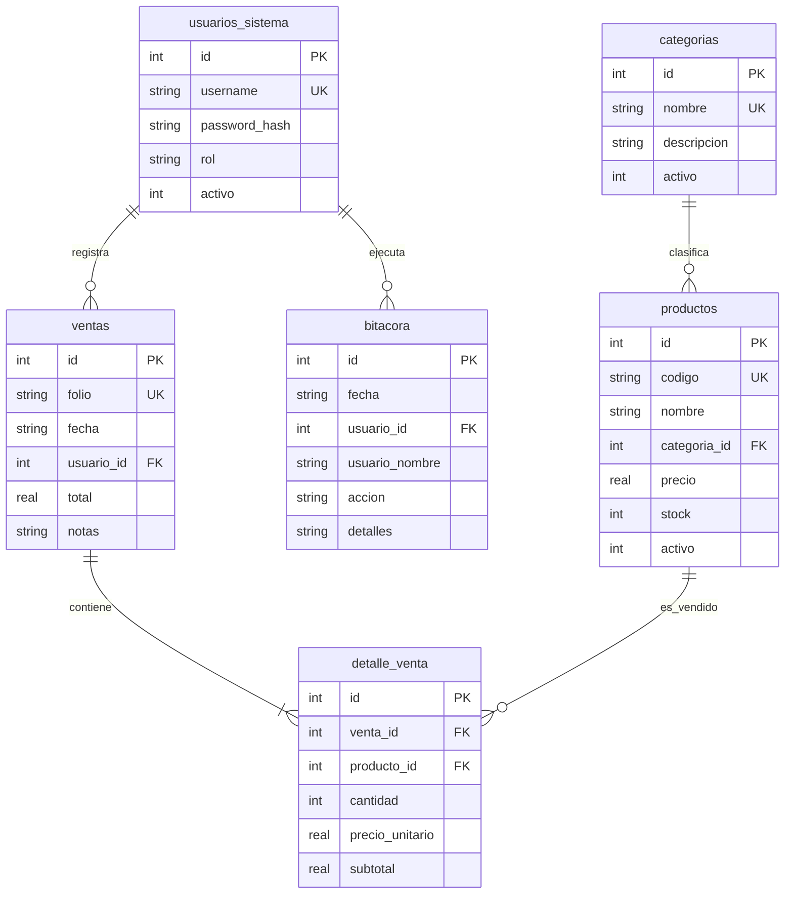

# 🏪 Mini Punto de Venta e Inventario (MiniPOS)

**Materia:** Tópicos Avanzados de Programación — Unidad 1: Proyecto Final  
**Opción Seleccionada:** Opción 2 — Inventario / Mini Punto de Venta  
**Stack Tecnológico:** Python 3.10+, Tkinter / ttk, SQLite 3, hashlib (SHA-256), csv, PyInstaller  

---

## 📋 Descripción del Proyecto

**MiniPOS** es una aplicación de escritorio orientada a objetos desarrollada en Python con Tkinter y persistencia relacional en SQLite. Resuelve la necesidad de gestión comercial, control estricto de existencias en almacén y registro ágil de ventas para pequeños comercios locales (como papelerías, cafeterías, tiendas escolares o misceláneas). El sistema garantiza integridad referencial estricta, control de acceso basado en roles con contraseñas encriptadas, carrito de compras dinámico con descuento atómico de inventario, consultas relacionales multillave (`JOIN`), reportes de contingencia (alerta de stock bajo) y exportación a archivos CSV.

---

## ⚙️ Requisitos del Sistema

- **Python:** Versión 3.10 o superior (Tkinter y SQLite vienen incluidos de fábrica en Windows y macOS).
- **Librerías estándar utilizadas:**
  - `tkinter` y `tkinter.ttk`: Interfaz gráfica moderna con componentes visuales desacoplados.
  - `sqlite3`: Persistencia relacional con activación obligatoria de `PRAGMA foreign_keys = ON`.
  - `hashlib`: Algoritmo criptográfico SHA-256 para almacenamiento seguro de credenciales.
  - `csv`: Generación de reportes analíticos exportables.
- **Librería opcional para generar el ejecutable:**
  - `pyinstaller>=6.0.0` (indicado en [`requirements.txt`](./requirements.txt)).

---

## 🚀 Métodos de Instalación y Ejecución

Tienes a tu disposición **tres métodos** para instalar y utilizar la aplicación según tus necesidades:

---

### 📦 Método 1: Instalación mediante Archivo Ejecutable (`.EXE`) para Windows
Ideal para usuarios finales y entrega directa al profesor; **no requiere tener Python instalado ni configurar entornos virtuales**:

1. **Ubicación del ejecutable:**  
   El binario compilado se encuentra listo para usar en la carpeta:  
   `dist/MiniPOS_Inventario.exe`
2. **Ejecución directa:**  
   Haz doble clic sobre `MiniPOS_Inventario.exe`.
   > **Nota de Windows SmartScreen:** Como el ejecutable fue compilado localmente con PyInstaller sin certificado comercial de firma digital, Windows podría mostrar la pantalla azul protectora:  
   > ➔ Haz clic en **"Más información"** y luego en **"Ejecutar de todas formas"**.
3. **Persistencia automática:**  
   Al abrirse por primera vez, el `.exe` creará de forma autónoma el archivo de base de datos relacional `inventario_pos.db` en el mismo directorio donde se encuentre, inicializando las tablas e insertando los datos de prueba obligatorios.

---

### 🗜️ Método 2: Instalación mediante Archivo Comprimido (`.ZIP`) Portable
Ideal para transportar el sistema en una memoria USB, distribuirlo como entrega empaquetada o usarlo en cualquier computadora sin instalar nada:

1. **Descarga / Ubicación del archivo ZIP:**  
   El paquete portable se encuentra generado en:  
   `dist/MiniPOS_Inventario_v1.0_Windows.zip`
2. **Extracción de los archivos:**  
   * Haz clic derecho sobre `MiniPOS_Inventario_v1.0_Windows.zip`.
   * Selecciona **"Extraer todo..."** (o usa 7-Zip / WinRAR).
   * Elige la carpeta donde deseas alojar el sistema (por ejemplo, en tu *Escritorio* o *Documentos*) y presiona **Extraer**.
3. **Inicio del sistema:**  
   * Entra a la carpeta descomprimida.
   * Haz doble clic en `MiniPOS_Inventario.exe`.
   * El sistema iniciará inmediatamente y guardará toda la información en la base de datos dentro de esa misma carpeta extraída.

---

### 💻 Método 3: Ejecución desde Código Fuente con Python (Modo Desarrollador)
Para ejecutar, modificar o evaluar el código fuente modular directamente:

1. Abre tu terminal o PowerShell en el directorio raíz del proyecto:
   ```powershell
   cd tap_pos_inventario
   ```
2. (Opcional) Instalar dependencias si deseas compilar nuevamente con PyInstaller:
   ```powershell
   python -m pip install -r requirements.txt
   ```
3. Ejecutar la aplicación:
   ```powershell
   python main.py
   ```
4. Ejecutar la batería completa de pruebas automatizadas:
   ```powershell
   python test_sistema.py
   ```

---

## 👥 Usuarios y Credenciales de Prueba (A.5)

El sistema genera de forma automática los usuarios iniciales con sus contraseñas encriptadas en SHA-256 (nunca texto plano):

| Usuario | Contraseña | Rol | Permisos y Alcance |
| :--- | :--- | :--- | :--- |
| **`admin`** | `admin123` | **Administrador** | Acceso total: CRUD de productos, CRUD de categorías, punto de venta, reportes analíticos, gestión de cuentas de personal y auditoría. |
| **`cajero`** | `cajero123` | **Operador** | Operación de mostrador: Registro de ventas, consulta de catálogos e historial. **Restringido:** No tiene acceso a la gestión de cuentas del personal (RF-2). |
| **`inactivo_demo`** | `demo123` | **Operador** | Usuario de prueba marcado como inactivo (`activo = 0`). El sistema bloquea su acceso en el login (A.4). |

---

## 🗄️ Modelo de Datos Relacional (SQLite)

La base de datos relacional utiliza claves foráneas obligatorias (`PRAGMA foreign_keys = ON;`) y validaciones de integridad (`CHECK` y `UNIQUE`).



### Descripción de Tablas:
1. **`usuarios_sistema`**: Credenciales hash SHA-256, roles (`administrador` / `operador`) y estado de actividad.
2. **`categorias` (Entidad B)**: Clasificación de productos con descripción y estado.
3. **`productos` (Entidad A)**: Catálogo de artículos con código único, categoría foránea, precio unitario (> 0), existencia física (>= 0) y estado de actividad.
4. **`ventas` (Movimiento de Negocio)**: Cabecera con folio único correlativo, fecha ISO, cajero foráneo, total acumulado y notas.
5. **`detalle_venta` (Detalle de Movimiento)**: Relaciona la venta con el producto vendido, congelando el `precio_unitario` al momento de la transacción para mantener la consistencia contable histórica.
6. **`bitacora` (Extra Opcional)**: Registro de auditoría con fecha, usuario y acción realizada.

---

## ✨ Funcionalidades y Cumplimiento de Requisitos

### Requisitos Funcionales (RF-1 al RF-10):
- **RF-1 (Creación automática):** La base de datos `.db` y sus tablas se autogeneran de forma idempotente en el arranque inicial mediante `DatabaseConexion.inicializar_base_datos()`.
- **RF-2 & RF-3 (Seguridad y Roles):** Inicio de sesión con autenticación criptográfica SHA-256. Control estricto donde el operador no puede gestionar cuentas de personal.
- **RF-4 (CRUD Completo de Entidades):**
  - **Productos (Entidad A):** Alta, edición, listado con búsqueda/filtros por categoría y activación/desactivación.
  - **Categorías (Entidad B):** Alta, edición, listado con búsqueda y alternancia de estado.
- **RF-5 (Proceso de Negocio Atómico):** Punto de venta interactivo con carrito, cálculo en vivo de totales, validación de inventario suficiente y descuento transaccional simultáneo al registro de la venta.
- **RF-6 (Búsqueda en Treeview):** Filtros en caliente en todas las tablas mediante eventos de teclado (`KeyRelease`).
- **RF-7 (Consultas SQL con JOIN):** Vista dedicada que ejecuta un `JOIN` entre `detalle_venta`, `ventas`, `productos`, `categorias` y `usuarios_sistema`, desplegando el desglose relacional completo.
- **RF-8 (Reporte del Caso Problemático):** Panel especializado que detecta y alerta sobre productos con **Stock Bajo o Crítico** ($\le 5$ unidades) resaltados en colores distintivos.
- **RF-9 (Confirmaciones preventivas):** Diálogos modales con `messagebox.askyesno` antes de aplicar eliminaciones o cambios irreversibles.
- **RF-10 (Integridad Referencial):** Si un producto ya cuenta con historial de ventas o una categoría tiene productos asociados, el sistema bloquea su eliminación física y ofrece desactivarlo para proteger la integridad relacional.

### Requisitos No Funcionales (RNF-1 al RNF-5):
- **RNF-1 & RNF-2 (Arquitectura limpia por capas):** Separación total sin sentencias SQL en la interfaz gráfica. Los widgets de UI invocan únicamente métodos de la capa `services/`, y éstos se comunican con `repositories/`.
- **RNF-3 (ttk y modales):** Interfaz estilizada con `ttk.Style`, pestañas `Notebook` y diálogos modales `Toplevel` con retención de foco (`grab_set`).
- **RNF-4 (Tolerancia a fallos y validación):** Captura limpia de excepciones (`IntegrityError`, `ValueError`, campos vacíos, tipos erróneos) para evitar cierres inesperados.
- **RNF-5 (Consistencia de idioma):** Nomenclatura 100% homogénea en español tanto en código fuente como en la experiencia de usuario.

---

## 🏛️ Estructura del Código Fuente

```text
tap_pos_inventario/
├── db/                         # Capa de base de datos
│   ├── __init__.py
│   ├── conexion.py             # Conexión SQLite, PRAGMA foreign_keys y CREATE TABLE
│   └── seed_data.py            # Datos de prueba iniciales (RF-1, A.5)
├── models/                     # Entidades de dominio puras (OOP sin widgets ni SQL)
│   ├── __init__.py
│   ├── usuario.py              # Clase Usuario
│   ├── categoria.py            # Clase Categoria (Entidad B)
│   ├── producto.py             # Clase Producto (Entidad A)
│   ├── venta.py                # Clases Venta y DetalleVenta (Movimiento)
│   └── bitacora.py             # Clase Bitacora (Auditoría)
├── repositories/               # Capa de acceso a datos (Persistencia SQL y mapeo a objetos)
│   ├── __init__.py
│   ├── usuario_repository.py
│   ├── categoria_repository.py
│   ├── producto_repository.py
│   ├── venta_repository.py     # Transacciones atómicas de venta y consultas JOIN
│   └── bitacora_repository.py
├── services/                   # Capa de lógica y reglas de negocio
│   ├── __init__.py
│   ├── auth_service.py         # Login, hashing SHA-256 y permisos por rol
│   ├── categoria_service.py    # Reglas e integridad de categorías
│   ├── producto_service.py     # Validaciones de precio/stock e integridad
│   ├── venta_service.py        # Orquestación de carrito y cobro
│   └── reporte_service.py      # Agregaciones, stock bajo y exportación CSV
├── ui/                         # Capa de presentación gráfica (Tkinter y ttk)
│   ├── __init__.py
│   ├── theme.py                # Estilos visuales modernos, paleta y tipografía
│   ├── login_window.py         # Ventana de autenticación
│   ├── main_window.py          # Ventana principal, navegación y barra de estado
│   ├── punto_venta_view.py     # Interfaz de mostrador y carrito de compra
│   ├── productos_view.py       # Catálogo A con Treeview y modal Toplevel
│   ├── categorias_view.py      # Catálogo B con Treeview y modal Toplevel
│   ├── ventas_historial_view.py# Historial de ventas y vista plana SQL JOIN
│   ├── reportes_view.py        # Reporte de stock bajo (RF-8) y más vendidos
│   └── usuarios_view.py        # Gestión de personal (solo administradores)
├── dist/                       # Ejecutable compilado para Windows
│   └── MiniPOS_Inventario.exe  # Aplicación empaquetada lista para usar
├── main.py                     # Punto de entrada de la aplicación
├── test_sistema.py             # Batería de pruebas automatizadas
├── requirements.txt            # Lista de dependencias del entorno
├── .gitignore                  # Exclusión de archivos temporales y compilados
└── README.md                   # Documentación completa del proyecto
```

---

## 🎁 Extras Opcionales Implementados (A.6)

1. **Bitácora de Auditoría Interna:** Registro cronológico de acciones críticas realizadas por cada usuario (inicios de sesión, creación de artículos, cambios de precio y registros de ventas).
2. **Exportación a CSV:** Tanto el listado relacional con JOIN como los reportes de Stock Bajo y Productos Más Vendidos cuentan con botones de exportación a formato `.csv` compatible con Excel.
3. **Ejecutable Standalone (.EXE):** Empaquetado completo con PyInstaller que permite correr el sistema en cualquier PC Windows con un solo clic.
4. **Diseño Visual ttk:** Tema visual sobrio con paleta Slate/Navy Blue, tarjetas contenedoras, realce cromático de filas con stock en riesgo y estados de conexión en la barra inferior.
